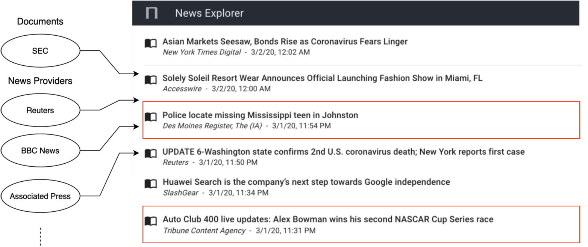
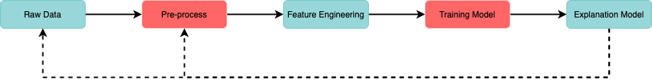
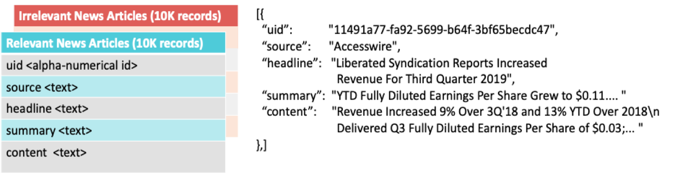

# UW-MSDS Capstone 2020

This github repository holds all the code and documentation for UW Data Science Final Capstone Project. The team members part 
of this project are Frank Chen, Apoorva Shetty, Kamala V J, Tharun Sikhinam.

# D-Classified News

## Introduction
This capstone project is an undertaking by the students of UW in their data science class.

### Problem Statement
Noonum is a fin-tech AI startup that leverages graphs and NLP to be a knowledge engine for business and finance. Their current news dashboard (As seen below) contains both relevant and irrelevant news articles. The aim of this project is to classify news articles as relevant or irrelevant based on their "market-relevance" and to explain why this classification was made, so as to better service their clients with their news dashboard.

### Proposed Solution

Our proposed solution involved four major components plugged together to create a fully functional classification and explanation model.

Our basic concept involved processing the raw text to remove stop words and perform other cleaning tasks before feeding it into the feature engineering module, from where our training model would learn to classify each article. These classified articles would be fed into an explanation model to generate individual explanation for each articles. the insights that we gained using this explanation would be used to fine-tune our pre-processing and re-label our data.

This repo contains these four modules and can be executed to get the results we obtained

## Data

## Folder Structure

## How to use this repository

### Preprocess the data
### Feature Engineering
### Train or use pre-trained Models
### Generating Explanations

## Conclusion
- Simpler feature sets such as BoW and TF-IDF performed well. Aggressive cleaning & pre-processing w.r.t to the context of the application improved the accuracy of the model.
- LIME gave us a clearer picture of what our model was truly learning; indicating that the market relevant terms were being captured by the models. 
- The task lying ahead is to provide for a feedback loop to re-incorporate what we learn from our explanation into labelling the data, and also into our data pre-processing and feature-engineering steps.

## References
- [1] [LIME repository](https://github.com/marcotcr/lime) - @marcotr

- [2] [LIME published paper](https://arxiv.org/abs/1602.04938) - Marco Tulio R., et al

